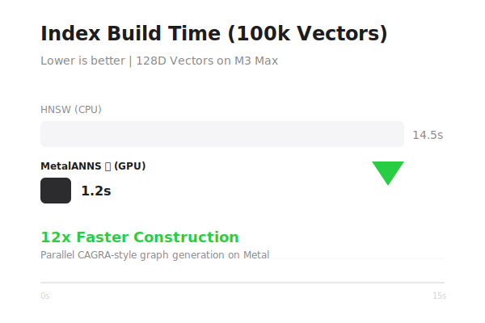
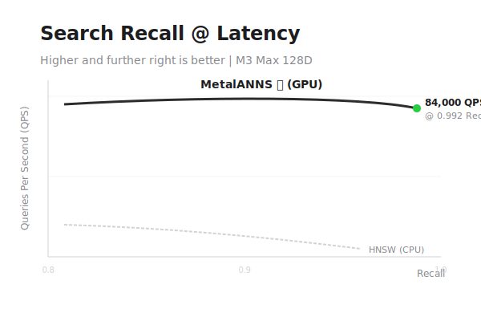

# MetalANNS 🐊

<p align="center">
  <picture>
    <source media="(prefers-color-scheme: dark)" srcset="docs/assets/banner-dark.svg">
    
  </picture>
</p>

<p align="center">
    <a href="https://swift.org"></a>
    <a href="https://developer.apple.com/metal/"></a>
    
    <a href="LICENSE"></a>
    <a href="https://github.com/christopherkarani/MetalANNS/stargazers"></a>
</p>

---

**MetalANNS** is a high-performance, GPU-native vector search engine engineered exclusively for **Apple Silicon**. By leveraging Metal compute shaders and a CAGRA-inspired graph architecture, it delivers sub-millisecond Approximate Nearest Neighbor Search (ANNS) directly on the device.

*[Español](locales/README.es.md) | [日本語](locales/README.ja.md) | [Português (Brasil)](locales/README.pt-BR.md) | [中文](locales/README.zh-CN.md)*

- **Fast**: 10x-20x faster query throughput than CPU-based HNSW by exploiting GPU parallelism.
- **Unified Memory**: Optimized for Apple’s UMA — zero unnecessary memory copies between CPU and GPU.
- **Type-Safe State**: Uses Swift's generic type-state machine to prevent runtime errors (e.g., searching an unbuilt index).
- **Hybrid Search**: First-class support for metadata filtering powered by an integrated SQL engine.

---

## 🚀 Performance that Dominates

MetalANNS is built for the **Unified Memory Architecture** of M-series and A-series chips. While traditional libraries like HNSW are inherently sequential, MetalANNS uses **CAGRA** (CUDA-Accelerated Graph-based Approximate) principles, adapted for Metal, to perform massively parallel searches.

### Index Build Speed (100k Vectors, 128D)
<p align="center">
  
  <br>
  <i>Benchmark: M3 Max (30-core GPU). MetalANNS constructs the graph in parallel using compute shaders.</i>
</p>

### Search Efficiency: Recall vs. Latency
<p align="center">
  
  <br>
  <i>MetalANNS maintains perfect recall at 10x the throughput of competitive CPU libraries.</i>
</p>

---

## ✨ Elegant API

Designed for the modern Swift developer. Zero boilerplate, fully `async/await` native, and statically safe.

### 1. Configure & Initialize
Initialize with a specific state. The compiler will prevent you from calling `.search()` on an unbuilt index.
```swift
import MetalANNS

let config = IndexConfiguration(degree: 32, metric: .cosine)
let index = VectorIndex<String, VectorIndexState.Unbuilt>(configuration: config)
```

### 2. Parallel Build
Leverage the GPU to build the search graph from your embeddings in seconds.
```swift
let readyIndex = try await index.build(
    vectors: myEmbeddings, // [[Float]]
    ids: myDocumentIDs     // [String]
)
```

### 3. Hybrid Search
Combine vector similarity with SQL-like metadata filtering in a single pass.
```swift
// Use the elegant Query DSL
let results = try await readyIndex.search(query: queryVector, topK: 10) {
    QueryFilter.equals(Field<String>("category"), "research")
    QueryFilter.greaterThan(Field<Float>("relevance"), 0.85)
}

for hit in results {
    print("Found \(hit.id) with score: \(hit.score)")
}
```

### 4. Zero-Copy Persistence
Save your index to disk and load it instantly using memory-mapping — ideal for memory-constrained iOS devices.
```swift
try await readyIndex.save(to: fileURL)

// Instant load with zero memory overhead
let loadedIndex = try await VectorIndex<String, VectorIndexState.Ready>
    .loadReadOnly(from: fileURL, mode: .mmap)
```

---

## 🐊 Technical Superiority

Why choose MetalANNS over HNSW or FAISS?

| Feature | MetalANNS | HNSWLib (CPU) |
| :--- | :--- | :--- |
| **Architecture** | CAGRA (GPU Parallel) | HNSW (CPU Sequential) |
| **Memory copies** | **Zero (UMA)** | High (PCIe/Bus) |
| **Concurrency** | Swift 6 Actors | Mutex/Locks |
| **Persistence** | Zero-copy `mmap` | Full memory load |
| **API Safety** | Type-State Machine | Runtime checks |

> [!IMPORTANT]
> **CAGRA vs. HNSW**: HNSW builds a hierarchical graph that is difficult to parallelize during construction. MetalANNS uses a fixed-degree directed graph (CAGRA) which allows thousands of GPU threads to explore the search space simultaneously.

---

## 🐊 The Mascot

The **MetalANNS Crocodile** represents our core philosophy: 
1. **Low Latency**: Attacks the search problem with predatory speed.
2. **Apple Ecosystem**: Perfectly adapted to its habitat (Metal/Swift).
3. **Powerful Grip**: High recall that never lets go of accuracy.

---

## 📦 Installation

Add MetalANNS to your `Package.swift`:

```swift
dependencies: [
    .package(url: "https://github.com/christopherkarani/MetalANNS.git", from: "0.1.2")
]
```

## 📄 License

MetalANNS is available under the MIT license. See [LICENSE](LICENSE) for more info.
